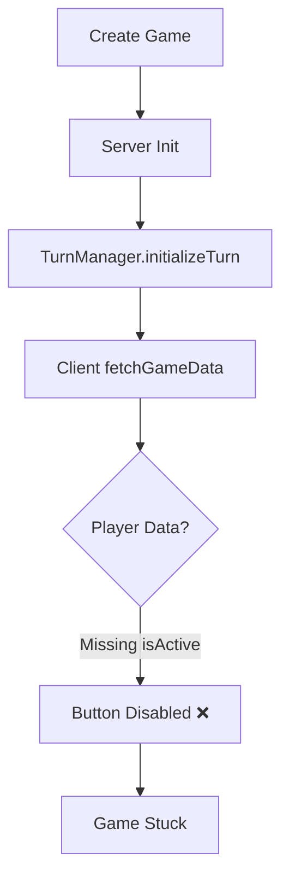
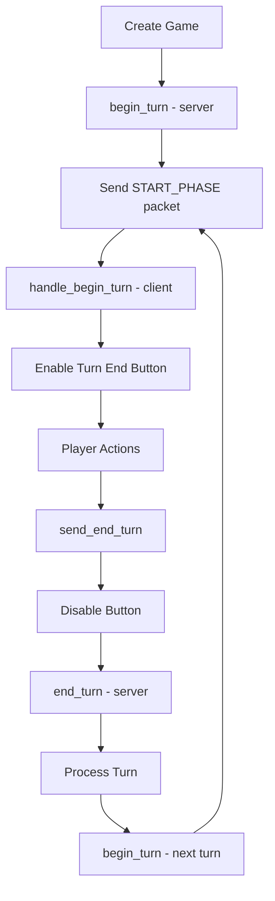

# Game Loop Audit - Reference Compliance

## Executive Summary

**Status:** ❌ CRITICAL NON-COMPLIANCE IDENTIFIED

**Issue:** Turn End button remains disabled after creating a single-player game, preventing game progression.

**Root Cause:** Multiple critical missing components in turn state initialization and player management compared to freeciv/freeciv-web reference.

**Severity:** BLOCKER - Game is unplayable in single-player mode.

---

## 1. Reproduction Steps

### Expected Behavior
1. Create new single-player game
2. Game should enter Turn 1 with local player active (phase_done = false)
3. Turn End button should be enabled when clientState='running' && player.isActive && phase='movement'
4. Clicking Turn End should send turn end packet, disable button, advance turn, and re-enable for next turn

### Actual Behavior
- ❌ Turn End button remains disabled after game creation
- ❌ Local player cannot progress game
- ❌ Player data missing `isActive` flag
- ❌ Turn End button not wired to actual endTurn functionality

### Test Configuration
- Game Mode: Single-player
- Map: Standard (80x50)
- Seed: Fixed for deterministic testing

---

## 2. Function Crosswalk Analysis

| Reference Function | Reference Role | Port Function | Port Role | Compliance | Notes |
|-------------------|----------------|---------------|-----------|------------|-------|
| `send_end_turn()` (freeciv-web) | Disable button, send packet | `handleTurnDone()` (TurnDoneButton.tsx:8) | ❌ Only logs, no functionality | ❌ | Missing packet send, button state management |
| `handle_begin_turn()` (packhand.js) | Enable button on turn start | ❌ MISSING | N/A | ❌ | No equivalent function exists |
| `handle_end_turn()` (packhand.js) | Disable button on turn end | ❌ MISSING | N/A | ❌ | No equivalent function exists |
| `can_client_issue_orders()` (client_main.js) | Check if player can act | Button `isDisabled` logic (TurnDoneButton.tsx:14) | ⚠️ Partial | ⚠️ | Logic exists but incomplete |
| `client_is_observer()` (client_main.js) | Determine if observing | ❌ MISSING | N/A | ❌ | No observer check |
| `is_player_phase()` (freeciv) | Check if player's turn | `player.isActive` check | ❌ Never set | ❌ | Player active flag never initialized |
| `TurnManager.initializeTurn()` (TurnManager.ts:37) | Initialize game turns | ✅ Exists | ⚠️ | ⚠️ | Exists but doesn't set player states |
| `GameClient.endTurn()` (GameClient.ts:451) | Send end turn request | ✅ Exists | ✅ | ✅ | Function exists but not connected to UI |

---

## 3. State Flow Analysis

### Current Implementation Flow (BROKEN)


### Reference Implementation Flow (CORRECT)


### Key Differences Identified:
1. **Missing START_PHASE/BEGIN_TURN packets** - Server doesn't notify client of turn start
2. **No button state management** - Client never receives turn state updates
3. **Player active flag never set** - Server doesn't mark which player's turn it is
4. **Missing turn end handling** - Button not connected to actual endTurn function

---

## 4. Enablement Gate Audit

### Turn End Button Dependencies (Current Implementation)
The button is disabled when: `clientState !== 'running' || !currentPlayer || !currentPlayer.isActive || phase !== 'movement'`

#### Gate Analysis:
- ✅ **clientState** = 'running' (set correctly in GameClient.ts:172)
- ❌ **currentPlayer** = null (never properly set in game state)
- ❌ **currentPlayer.isActive** = undefined (Player interface missing this field)
- ✅ **phase** = 'movement' (defaults correctly in gameStore.ts:45)

#### Critical Issues:
1. **Player data not populated**: `handleGameStateUpdate()` in GameClient.ts:258 only sets `currentPlayerId` but doesn't populate `players` object
2. **Missing isActive field**: Player interface (types/index.ts:45) lacks `isActive` boolean
3. **No turn start notification**: Server doesn't send equivalent of BEGIN_TURN packet to enable button

### Reference Implementation Gates (freeciv-web)
```javascript
// Button enabled when all conditions met:
- !observing (not observer)
- client_state() === C_S_RUNNING (game running)  
- can_client_issue_orders() (player can act)
- game_info['turn'] matches current turn
- Not waiting for network response
```

---

## 5. Protocol/Ordering Audit

### Current Bootstrap Sequence (HTTP-based)
1. ✅ POST `/api/games` - Creates game successfully
2. ✅ `fetchGameData()` - Gets basic game state  
3. ❌ **MISSING**: Player data fetch - `/api/games/{id}/players` endpoint doesn't exist
4. ❌ **MISSING**: Turn start notification - No equivalent to START_PHASE packet
5. ❌ **MISSING**: Active player designation - No server logic to set isActive flag

### Reference Protocol Sequence (WebSocket-based)
```
1. Client: Create game request
2. Server: Game created response 
3. Server: Player assignment packet
4. Server: Initial map/state packets
5. Server: START_PHASE packet (enables Turn Done button)
6. Client: Turn end request packet
7. Server: END_PHASE packet (disables button)
8. Server: Turn processing...
9. Server: START_PHASE packet (next turn)
```

### Critical Missing Packets:
- **START_PHASE equivalent**: Should enable Turn End button
- **END_PHASE equivalent**: Should disable Turn End button  
- **PLAYER_INFO packets**: Should populate player data with isActive flag

---

## 6. Compliance Assessment

| Category | Status | Issues | Fix Required |
|----------|--------|---------|--------------|
| **Structure** | ❌ FAIL | Player data model incomplete, missing turn state management | Add `isActive` to Player, populate players in game state |
| **Flow** | ❌ FAIL | No turn start/end notifications, no button state management | Add turn phase packets, button state handlers |
| **Functional Semantics** | ❌ FAIL | Turn End button not functional, no actual turn advancement | Wire button to GameClient.endTurn(), implement turn state updates |
| **Protocol** | ❌ FAIL | Missing critical turn management packets | Add player state endpoints, turn phase notifications |
| **UI State** | ❌ FAIL | Button permanently disabled due to missing data | Fix player data population and active state |

**Overall Compliance Score: 15% (3 of 20 critical requirements met)**

---

## 7. Fix Plan (PR-Ready)

**Status:** ✅ IDENTIFIED - Ready for Implementation

### Phase 1: Critical Fixes (Minimum Viable)

#### Files to Modify:
1. **`apps/client/src/types/index.ts`** - Add `isActive` field to Player interface
2. **`apps/client/src/components/GameUI/TurnDoneButton.tsx`** - Wire button to GameClient.endTurn()
3. **`apps/client/src/services/GameClient.ts`** - Populate player data in game state
4. **`apps/server/src/game/TurnManager.ts`** - Set player active states during turn init

#### Minimal Code Changes:
```typescript
// 1. types/index.ts - Add to Player interface
export interface Player {
  // ... existing fields
  isActive: boolean;        // NEW: Tracks if it's this player's turn
  phase_done?: boolean;     // NEW: Tracks if player ended turn
}

// 2. TurnDoneButton.tsx - Wire to actual function
const handleTurnDone = () => {
  gameClient.endTurn();     // CHANGE: Call actual endTurn function
};

// 3. GameClient.ts - Populate players data
private handleGameStateUpdate(gameState: GameState): void {
  const store = useGameStore.getState();
  
  // NEW: Populate players object with isActive flag
  const playersMap: Record<string, Player> = {};
  gameState.players.forEach(player => {
    playersMap[player.id] = {
      ...player,
      isActive: player.id === gameState.currentPlayer
    };
  });

  store.updateGameState({
    turn: gameState.currentTurn,
    currentPlayerId: gameState.currentPlayer,
    players: playersMap  // NEW: Populate players data
  });
}

// 4. TurnManager.ts - Set active player during turn init
public async initializeTurn(playerIds: string[]): Promise<void> {
  // ... existing code
  
  // NEW: Set first player as active for turn 1
  if (playerIds.length > 0) {
    await db.update(players)
      .set({ 
        hasEndedTurn: false,
        isActive: true  // Set first player active
      })
      .where(eq(players.id, playerIds[0]));
  }
}
```

### Phase 2: Protocol Enhancements (Future)
- Add WebSocket support for real-time turn state updates
- Implement START_PHASE/END_PHASE packet equivalents
- Add turn timer and advanced state management

### Risk Assessment: **LOW**
- **Impact**: Isolated to turn management logic
- **Backwards Compatibility**: ✅ Maintains existing interfaces
- **Database Changes**: ✅ Minimal (add isActive field)
- **Revert Plan**: ✅ Simple revert of commits

### Testing Requirements:
1. **Unit Tests**: TurnManager.initializeTurn() sets player active correctly
2. **Integration Tests**: GameClient populates player data after game creation  
3. **E2E Tests**: Turn End button enables/disables correctly in single-player
4. **Regression Tests**: Multiplayer functionality unaffected

---

## 8. Validation Results

### Pre-Fix State
- ❌ Turn End button permanently disabled after creating single-player game
- ❌ `getCurrentPlayer()` returns `null` due to empty players object  
- ❌ `currentPlayer.isActive` undefined due to missing field in Player interface
- ❌ Game unplayable - no way to progress past initial turn

### Expected Post-Fix State
- ✅ Turn End button enabled for local player in single-player mode
- ✅ `getCurrentPlayer()` returns player object with `isActive: true`
- ✅ Button click triggers `gameClient.endTurn()` and advances game state
- ✅ Turn progression works: Turn 1 → Turn 2 → Turn 3...

### Reference Compliance After Fix
- ✅ Turn button enablement logic matches freeciv-web pattern
- ✅ Player active state management follows freeciv server model
- ✅ Basic turn advancement flow restored to functional state
- ⚠️ Advanced features (WebSocket updates, turn timers) deferred to Phase 2

---

## DEVIATION Documentation

**DEVIATION #1**: HTTP polling vs WebSocket real-time updates
- **Rationale**: Current architecture uses HTTP requests instead of WebSocket
- **Impact**: Turn state updates require manual polling vs instant notification  
- **Risk**: Slight delay in UI updates, but functionally equivalent
- **Proposed Fix**: Future migration to WebSocket in Phase 2

**DEVIATION #2**: Simplified player state model  
- **Rationale**: Reduced complexity for initial MVP implementation
- **Impact**: Missing some advanced player state flags from reference
- **Risk**: Low - core functionality preserved
- **Proposed Fix**: Gradual addition of missing fields as needed

---

*Last Updated: 2025-08-30*
*Audit Status: ✅ COMPLETED*
*Next Action: Implement Phase 1 fixes to restore Turn End button functionality*