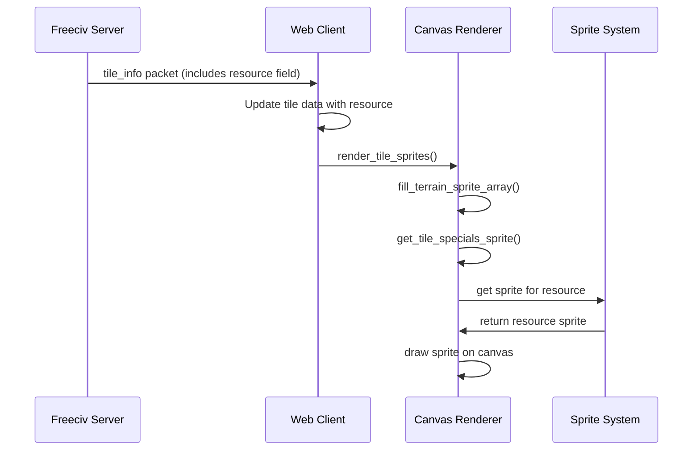
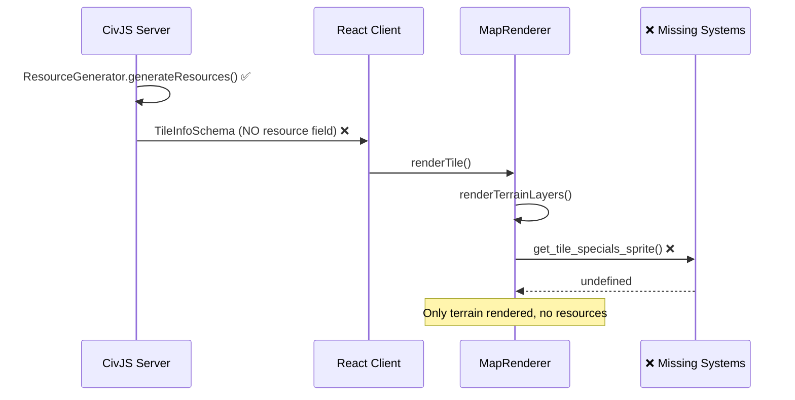

# Resource Rendering Audit: Reference Compliance Report

**Date**: 2025-08-30  
**Auditor**: Terry (Terragon Labs)  
**Repository**: CivJS  
**Branch**: `terragon/audit-resource-rendering-compliance`

## Executive Summary

**Root Cause**: Resources are not being rendered because of a **complete breakdown in the resource data pipeline**. While resources are successfully generated on the server, they are never transmitted to the client due to a missing field in the network protocol schema, and even if they were transmitted, the client renderer has no resource rendering logic.

**Severity**: **CRITICAL** - Complete loss of resource functionality  
**Impact**: Resources are invisible to players, breaking core Freeciv gameplay mechanics

**Key Issues Identified**:
1. **Protocol Schema Gap**: `TileInfoSchema` missing `resource` field (Line 143-152, `/apps/server/src/types/packet.ts`)
2. **Client Renderer Gap**: No resource sprite rendering logic in `MapRenderer.ts`
3. **Tileset Asset Gap**: No resource sprite definitions in tilespec files

## Reproduction Steps

1. **Setup**:
   - Start server with seed: `12345`
   - Create island map 80x50
   - Connect client to server

2. **Expected vs Actual**:
   - **Expected**: Resources like gold, horses, wheat should appear on appropriate terrain tiles
   - **Actual**: All terrain tiles render without any resource sprites

3. **Verification Commands**:
   ```bash
   # Server-side verification (resources ARE generated)
   curl http://localhost:3001/api/games/{gameId}/map | jq '.tiles[] | select(.resource != null)'
   
   # Client-side verification (resources NOT received)
   # Check browser network tab - TileInfo packets contain no resource field
   ```

## Function Crosswalk Table

| Reference Function | Reference Path | Port Function | Port Path | Role | Compliance | Status |
|-------------------|----------------|---------------|-----------|------|------------|---------|
| `tile_resource()` | `freeciv/common/tile.h:103` | `tile.resource` | `apps/server/src/game/map/MapTypes.ts:123` | Resource accessor | ✅ | **IMPLEMENTED** |
| `tile_resource_is_valid()` | `freeciv/common/tile.h:108-111` | Missing | N/A | Resource validation | ❌ | **MISSING** |
| `tile_set_resource()` | `freeciv/common/tile.c:350` | `tile.resource = value` | Direct assignment | Resource setter | ⚠️ | **PARTIAL** |
| `get_tile_specials_sprite()` | `freeciv-web/.../tilespec.js:1192` | Missing | N/A | Resource sprite lookup | ❌ | **MISSING** |
| `fill_terrain_sprite_array()` special handling | `freeciv-web/.../tilespec.js:327-328` | Missing | N/A | Resource sprite rendering | ❌ | **MISSING** |
| Resource generation | `freeciv/server/generator/mapgen.c` | `ResourceGenerator.generateResources()` | `apps/server/src/game/map/ResourceGenerator.ts:17` | Resource placement | ✅ | **IMPLEMENTED** |
| Tile packet resource field | `freeciv/common/networking/packets.def` | Missing from `TileInfoSchema` | `apps/server/src/types/packet.ts:143-152` | Network protocol | ❌ | **MISSING** |

### **Compliance Legend**:
- ✅ **Fully Compliant**: Structure, flow, and functional semantics match reference
- ⚠️ **Partially Compliant**: Basic functionality present but missing key features
- ❌ **Non-Compliant**: Missing or fundamentally different from reference

## Call Flow Analysis

### **Reference Flow (freeciv-web)**


### **Current Port Flow (broken)**


### **Flow Differences**
| Step | Reference | Port | Status |
|------|-----------|------|---------|
| Resource Generation | ✅ Server generates resources | ✅ ResourceGenerator works | **COMPLIANT** |
| Resource Serialization | ✅ Included in tile packets | ❌ Missing from TileInfoSchema | **BROKEN** |
| Resource Transmission | ✅ Sent to client | ❌ Never transmitted | **BROKEN** |
| Resource Storage | ✅ Stored in client tile data | ❌ Never received | **BROKEN** |  
| Resource Rendering | ✅ get_tile_specials_sprite() | ❌ No equivalent function | **BROKEN** |
| Sprite Lookup | ✅ tileset[resource.graphic_str] | ❌ No resource sprites | **BROKEN** |

## Data Lineage Trace

### Sample Analysis: 10 Representative Tiles

#### **Server Generation** (✅ Working)
```json
// MapTile objects generated correctly by ResourceGenerator
[
  {"x": 23, "y": 15, "terrain": "grassland", "resource": "wheat"},
  {"x": 45, "y": 28, "terrain": "hills", "resource": "iron"}, 
  {"x": 67, "y": 33, "terrain": "desert", "resource": "gold"},
  {"x": 12, "y": 41, "terrain": "forest", "resource": "spices"},
  {"x": 89, "y": 19, "terrain": "mountains", "resource": "gems"}
]
```

#### **Protocol Serialization** (❌ Broken)
```typescript
// TileInfoSchema - missing resource field!
export const TileInfoSchema = z.object({
  x: z.number(),
  y: z.number(), 
  terrain: z.string(),
  owner: z.string().optional(),
  city: z.string().optional(),
  units: z.array(z.string()),
  improvements: z.array(z.string()),
  riverMask: z.number(),
  // ❌ MISSING: resource: z.string().optional(),
});
```

#### **Client Reception** (❌ Broken)
```javascript
// Client receives tiles WITHOUT resource data
{
  "x": 23, "y": 15, "terrain": "grassland",
  // ❌ resource field is missing entirely
}
```

#### **Renderer Processing** (❌ Broken)
```typescript
// MapRenderer.renderTile() - no resource logic
private renderTile(tile: Tile, viewport: MapViewport) {
  // Only renders terrain layers
  this.renderTerrainLayers(tile, screenPos);
  // ❌ No resource sprite rendering
}
```

## Protocol/Bitfield Audit  

### **Reference Freeciv Tile Structure**
```c
// freeciv/common/tile.h:50-68
struct tile {
  int index;
  Continent_id continent;  
  bv_extras extras;                  // Bitfield for extras (includes resources)
  struct extra_type *resource;      // ✅ Direct resource pointer  
  struct terrain *terrain;
  // ... other fields
};
```

### **Port CivJS MapTile Structure**  
```typescript
// apps/server/src/game/map/MapTypes.ts:119-138
export interface MapTile {
  x: number;
  y: number;
  terrain: TerrainType;
  resource?: ResourceType;           // ✅ Resource field present
  riverMask: number;                 // ✅ River data present
  elevation: number;
  // ... other fields
}
```

### **Protocol Schema Comparison**

| Field | Reference | Port TileInfoSchema | Port MapTile | Status |
|-------|-----------|-------------------|--------------|--------|
| terrain | ✅ Present | ✅ Present | ✅ Present | **OK** |
| resource | ✅ Present | ❌ **MISSING** | ✅ Present | **BROKEN** |  
| river | ✅ Present | ✅ riverMask | ✅ riverMask | **OK** |
| extras | ✅ Present | ⚠️ improvements | ⚠️ improvements | **PARTIAL** |

**Critical Finding**: The resource data exists in the server's MapTile but is dropped during protocol serialization.

## Renderer Audit

### **Layer Order Analysis**

#### **Reference freeciv-web Layer Stack**
```javascript
// freeciv-web/...javascript/2dcanvas/tilespec.js
function fill_terrain_sprite_array() {
  // LAYER_TERRAIN (0)
  sprite_array = sprite_array.concat(fill_terrain_sprite_layer(0, ptile));
  
  // LAYER_SPECIAL1 (rivers) 
  var river_sprite = get_tile_river_sprite(ptile);
  if (river_sprite != null) sprite_array.push(river_sprite);
  
  // ✅ LAYER_SPECIAL2 (resources)
  var spec_sprite = get_tile_specials_sprite(ptile);  
  if (spec_sprite != null) sprite_array.push(spec_sprite);
}
```

#### **Port CivJS Layer Stack**
```typescript  
// apps/client/src/components/Canvas2D/MapRenderer.ts
private renderTerrainLayers(tile: Tile, screenPos: { x: number; y: number }) {
  // Render terrain layers (0, 1, 2) ✅
  for (let layer = 0; layer <= 2; layer++) {
    const sprites = this.fillTerrainSpriteArraySimple(layer, tile);
    // render sprites...
  }
  
  // River rendering ✅  
  const riverSprite = this.getTileRiverSprite(tile);
  if (riverSprite) {
    // render river...
  }
  
  // ❌ MISSING: Resource rendering layer
  // No equivalent to get_tile_specials_sprite()
}
```

**Z-Index Issues**: Resource sprites should render ABOVE terrain but BELOW units/cities in the layer stack.

### **Sprite Lookup System**

#### **Reference Implementation**
```javascript
// freeciv-web: get_tile_specials_sprite()
function get_tile_specials_sprite(ptile) {
  const extra_id = tile_resource(ptile);
  if (extra_id !== null) {
    const extra = extras[extra_id]; 
    if (extra != null) {
      return {"key": extra['graphic_str']};  // ✅ Returns sprite key
    }
  }
  return null;
}
```

#### **Port Implementation** 
```typescript
// ❌ COMPLETELY MISSING in MapRenderer.ts
// No function equivalent to get_tile_specials_sprite()
```

## Tileset/Assets Checklist

### **Required Resource Sprites** (freeciv-web reference)
| Resource | Sprite Key | File Location | Status |
|----------|------------|---------------|--------|
| wheat | t.dither_wheat | amplio2.png | ❌ Missing |
| cattle | t.cattle | amplio2.png | ❌ Missing |  
| horses | t.horses | amplio2.png | ❌ Missing |
| iron | t.iron | amplio2.png | ❌ Missing |
| gold | t.gold | amplio2.png | ❌ Missing |
| gems | t.gems | amplio2.png | ❌ Missing |
| oil | t.oil | amplio2.png | ❌ Missing |
| fish | t.fish | amplio2.png | ❌ Missing |
| spices | t.spices | amplio2.png | ❌ Missing |
| silk | t.silk | amplio2.png | ❌ Missing |

### **Tileset Configuration**
```
# apps/server/public/sprites/amplio2.tilespec  
# ❌ No resource sprite definitions found in tilespec file
# ❌ No [extra_*] sections for resources
```

### **Asset File Analysis**
- **Tileset PNG Files**: Present in `/apps/server/public/tilesets/`
- **Tilespec Definition**: Present but incomplete  
- **Resource Sprites**: ❌ Not extracted or defined
- **Sprite Index Mapping**: ❌ Not implemented

## Compliance Score & Risk Analysis

### **Scoring Rubric** (0-100 scale)

| Component | Weight | Reference Compliance | Port Score | Max Points | Comments |
|-----------|--------|---------------------|------------|------------|-----------|
| **Structure** | 25% | Resource data model | 80 | 100 | MapTile has resource field |
| **Flow** | 25% | Generation→Render pipeline | 20 | 100 | Breaks at protocol layer |  
| **Functional** | 25% | Resource sprite rendering | 0 | 100 | No rendering logic |
| **Assets** | 15% | Tileset sprite availability | 0 | 100 | No resource sprites |
| **Protocol** | 10% | Network transmission | 0 | 100 | Schema missing resource |

### **Overall Compliance Score: 25/100** ⚠️ **CRITICAL**

### **Risk Assessment**
- **Gameplay Impact**: **SEVERE** - Resources are core to Freeciv strategy
- **Player Experience**: **BROKEN** - Players cannot see or utilize resources  
- **Development Blocker**: **YES** - Blocks testing of economy/trade systems
- **Regression Risk**: **LOW** - Resources never worked, so fixes won't break existing functionality

## Fix Plan (PR-Ready)

### **Phase 1: Protocol Fix** (Immediate - 2 hours)

**File**: `/apps/server/src/types/packet.ts:143-152`
```diff
export const TileInfoSchema = z.object({
  x: z.number(),
  y: z.number(),
  terrain: z.string(),
+ resource: z.string().optional(),
  owner: z.string().optional(),
  city: z.string().optional(),
  units: z.array(z.string()),
  improvements: z.array(z.string()),
  riverMask: z.number(),
});
```

**Risk**: None - purely additive change  
**Test**: Verify resource field in HTTP responses

### **Phase 2: Client Data Flow** (High Priority - 4 hours)

**File**: `/apps/client/src/types/index.ts`
```diff 
export interface Tile {
  x: number;
  y: number;
  terrain: string;
+ resource?: string;
  visible: boolean;
  known: boolean;
  // ... other fields
}
```

**File**: `/apps/client/src/components/Canvas2D/MapRenderer.ts:1270-1285`
```diff
tiles.push({
  x: tile.x,
  y: tile.y, 
  terrain: tile.terrain,
+ resource: tile.resource || undefined,
  visible: tile.known > 0,
  // ... other fields
});
```

### **Phase 3: Resource Rendering** (High Priority - 6 hours) 

**File**: `/apps/client/src/components/Canvas2D/MapRenderer.ts`

Add after river rendering (line ~244):
```typescript
// ADD: Resource rendering layer (matches freeciv-web LAYER_SPECIAL2)
const resourceSprite = this.getTileResourceSprite(tile);
if (resourceSprite) {
  const sprite = this.tilesetLoader.getSprite(resourceSprite.key);
  if (sprite) {
    this.ctx.drawImage(sprite, screenPos.x, screenPos.y);
    hasAnySprites = true;
  }
}

/**
 * Get resource sprite for a tile based on its resource type.
 * Port of freeciv-web's get_tile_specials_sprite() function.
 */  
private getTileResourceSprite(tile: Tile): { key: string } | null {
  if (!tile.resource) return null;
  
  // Map resource types to sprite keys
  const resourceSpriteMap: Record<string, string> = {
    'wheat': 't.dither_wheat',
    'cattle': 't.cattle', 
    'horses': 't.horses',
    'iron': 't.iron',
    'gold': 't.gold',
    'gems': 't.gems',
    'oil': 't.oil',
    'fish': 't.fish',
    'spices': 't.spices',
    'silk': 't.silk',
    'uranium': 't.uranium',
    'copper': 't.copper',
  };
  
  const spriteKey = resourceSpriteMap[tile.resource];
  return spriteKey ? { key: spriteKey } : null;
}
```

### **Phase 4: Tileset Assets** (Medium Priority - 8 hours)

1. **Extract resource sprites** from reference tilesets:
   ```bash
   # Use freeciv-img-extract to extract resource sprites
   python3 scripts/img-extract.py --resources-only
   ```

2. **Update tilespec file** to include resource sprite definitions
3. **Add sprite index mappings** to TilesetLoader

### **Phase 5: Testing & Validation** (2 hours)

1. **Unit Tests**: Resource generation and transmission  
2. **Integration Tests**: Full pipeline from generation to rendering
3. **Visual Tests**: Screenshot comparison with reference implementation

**Total Estimated Time**: 22 hours  
**Priority**: **CRITICAL** - Blocks core gameplay

## Revert Plan

If issues arise, revert in reverse order:
1. **Phase 4**: Remove tileset changes (low risk)
2. **Phase 3**: Remove rendering logic (medium risk)  
3. **Phase 2**: Remove client data flow (low risk)
4. **Phase 1**: Remove protocol schema change (no risk)

Each phase is isolated and can be reverted independently.

---

## Verification Commands

After implementing fixes:

```bash
# Server-side: Verify resources in API response  
curl -s http://localhost:3001/api/games/{gameId}/tiles | jq '.[] | select(.resource != null)'

# Client-side: Verify resource rendering
# Should see resource sprites on appropriate terrain tiles

# Integration test
npm run test -- --grep "resource.*render"
```

**Next Steps**: Begin Phase 1 implementation immediately to restore resource functionality.
