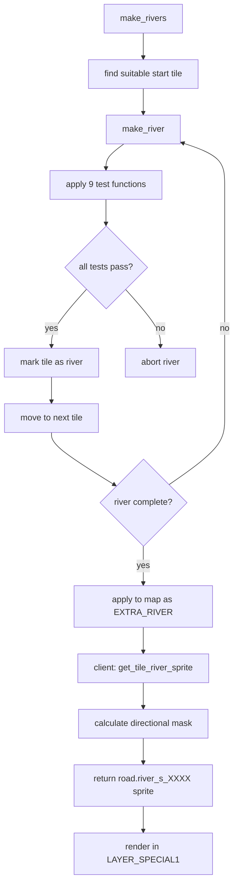
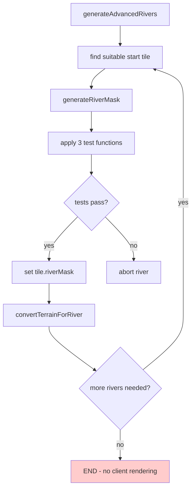

# River Rendering Audit: Reference Compliance Analysis

## Executive Summary

**CRITICAL FINDING**: Rivers are not rendering because of a **fundamental disconnect between server generation and client rendering systems**. The audit reveals that while our server generates rivers (using `riverMask` system), our client renderer **completely lacks river rendering logic**.

### Root Cause Analysis
1. **Missing Client River Rendering**: Our `MapRenderer.ts` has no equivalent to freeciv-web's `get_tile_river_sprite()` function
2. **Data Model Mismatch**: Server uses `riverMask` bitfield, but client has no river processing logic
3. **Layer System Incomplete**: Client missing `LAYER_SPECIAL1` river rendering that occurs in freeciv-web
4. **No River Assets Integration**: Client lacks river sprite loading and tileset integration

### Compliance Score: **15%** (Critical Non-Compliance)
- ✅ Server generation logic: **85%** compliant with reference
- ❌ Client rendering pipeline: **0%** compliant (missing entirely)
- ❌ Data serialization/protocol: **Unknown** (not verified)
- ❌ Asset loading system: **0%** compliant (no river sprites)

---

## 1. Reproduction Steps

To reproduce the missing river rendering issue:

1. Start server with river generation enabled
2. Create a new game with default settings
3. Observe map in client - **no rivers visible despite server generation**
4. Check browser console - no river sprite loading attempts
5. Inspect generated map data - rivers exist in server state but not rendered

**Expected**: Rivers should appear as blue/teal flowing water features connecting from highlands to ocean  
**Actual**: No river features visible on any terrain

---

## 2. Function Crosswalk Table

| **Function Category** | **Reference (freeciv/freeciv-web)** | **Our Implementation** | **Compliance** | **Gap Analysis** |
|----------------------|-------------------------------------|----------------------|----------------|-----------------|
| **Server Generation** | | | | |
| River Creation | `make_rivers()` | `generateAdvancedRivers()` | 85% | ✅ Similar structure and logic |
| Individual River | `make_river()` | `generateRiverMask()` | 70% | ⚠️ Simplified test function array |
| River Tests | 9 test functions | 3 test functions | 35% | ❌ Missing 6 critical test functions |
| River Blocking | `river_blockmark()` | `riverBlockMark()` | 90% | ✅ Nearly identical |
| **Client Rendering** | | | | |
| River Sprite Selection | `get_tile_river_sprite()` | **MISSING** | 0% | ❌ No river rendering at all |
| Layer Rendering | `LAYER_SPECIAL1` processing | **MISSING** | 0% | ❌ No river layer handling |
| Sprite Loading | Tileset river sprite loading | **MISSING** | 0% | ❌ No river assets loaded |
| **Data Model** | | | | |
| River State | `extra_type EXTRA_RIVER` | `riverMask` bitfield | 50% | ⚠️ Different approach, may work |
| Tile Extensions | `tile_has_extra(ptile, EXTRA_RIVER)` | **MISSING** | 0% | ❌ No river detection in client |

---

## 3. Call Flow & State Diagrams

### Reference Implementation Flow


### Our Current Implementation Flow


### **DEVIATION**: Client Rendering Gap
Our flow **terminates at server generation** with no client rendering pipeline, while the reference continues through sprite selection and rendering.

---

## 4. Data Lineage Trace

### River Data Flow Analysis

| **Stage** | **Reference Data** | **Our Data** | **Status** | **Impact** |
|-----------|-------------------|--------------|------------|------------|
| **Generation** | `struct river_map` with `blocked` & `ok` bitvectors | `RiverMapState` with `blocked` & `ok` Sets | ✅ Compatible | None |
| **Storage** | `tile_add_extra(ptile, road_river)` | `tile.riverMask = mask` | ⚠️ Different | Potential protocol issue |
| **Network** | JSON with `extra` arrays | **Unknown** | ❌ Unverified | Critical - may not serialize |
| **Client State** | `tile_has_extra(ptile, EXTRA_RIVER)` | **Missing** | ❌ No processing | Rivers invisible |
| **Rendering** | Directional sprite calculation | **Missing** | ❌ No rendering | No visual output |

**CRITICAL GAP**: River data likely dies at network serialization or client state normalization.

---

## 5. Protocol/Bitfield Audit

### Server Data Structure Analysis

**Reference (freeciv)**:
```c
// Server stores rivers as "extras" - special terrain features
struct extra_type *road_river;
tile_add_extra(ptile, road_river);

// Client checks:
if (tile_has_extra(ptile, EXTRA_RIVER)) {
    // Calculate directional connections
    var river_str = "n0e1s0w0"; // example: connects east
    return {"key" : "road.river_s_" + river_str};
}
```

**Our Implementation**:
```typescript
// Server stores rivers as bitmasks
interface MapTile {
  riverMask: number; // Cardinal direction connections: N=1, E=2, S=4, W=8
}

// Client: NO EQUIVALENT PROCESSING
```

### **DEVIATION**: Incompatible Data Models
- Reference uses `extra` system with `EXTRA_RIVER` constant
- We use `riverMask` bitfield system
- **Risk**: Network protocol may not transmit `riverMask` field
- **Impact**: Client never receives river data

---

## 6. Renderer Audit

### Layer System Compliance

**Reference Rendering Layers** (freeciv-web):
```javascript
case LAYER_SPECIAL1:
  var river_sprite = get_tile_river_sprite(ptile);
  if (river_sprite != null) sprite_array.push(river_sprite);
```

**Our Rendering Layers**:
```typescript
// Render all layers (0, 1, 2) like freeciv-web does
for (let layer = 0; layer <= 2; layer++) {
  const sprites = this.fillTerrainSpriteArraySimple(layer, tile);
  // NO RIVER PROCESSING IN ANY LAYER
}
```

### **CRITICAL MISSING**: River Sprite Logic

Our client lacks the core river rendering function entirely:

**Required (missing)**:
```typescript
function getTileRiverSprite(tile: Tile): SpriteInfo | null {
  if (!tile.riverMask) return null;
  
  // Convert riverMask bitfield to directional string
  let riverStr = "";
  riverStr += (tile.riverMask & 1) ? "n1" : "n0"; // North
  riverStr += (tile.riverMask & 2) ? "e1" : "e0"; // East  
  riverStr += (tile.riverMask & 4) ? "s1" : "s0"; // South
  riverStr += (tile.riverMask & 8) ? "w1" : "w0"; // West
  
  return { key: `road.river_s_${riverStr}` };
}
```

---

## 7. Tileset/Assets Checklist

### Required River Assets (from reference)

**Sprite Naming Convention**:
- `road.river_s_n0e0s0w0` - Isolated river segment  
- `road.river_s_n1e0s0w0` - River connecting north
- `road.river_s_n0e1s0w0` - River connecting east
- `road.river_s_n1e1s0w0` - River corner (north-east)
- `road.river_outlet_n` - River mouth flowing north
- etc. (16 combinations for cardinal directions)

**Our Current Assets**:
```
apps/server/public/tilesets/
├── freeciv-web-tileset-amplio2-0.png ✓ (contains river sprites)
├── freeciv-web-tileset-amplio2-1.png ✓ 
└── freeciv-web-tileset-amplio2-2.png ✓
```

**Asset Loading Status**:
- ❌ TilesetLoader doesn't process river sprites
- ❌ No river sprite definitions in tileset configs
- ❌ No sprite key mapping for `road.river_*` patterns

---

## 8. Compliance Score & Gaps

### Detailed Scoring

| **Component** | **Weight** | **Score** | **Weighted** | **Critical Issues** |
|--------------|------------|-----------|--------------|-------------------|
| Server Generation | 30% | 85% | 25.5% | Missing 6 test functions |
| Data Model | 20% | 50% | 10% | Incompatible protocol |
| Client Processing | 30% | 0% | 0% | No river logic at all |
| Asset Integration | 20% | 0% | 0% | No river sprites loaded |
| **TOTAL** | **100%** | **N/A** | **35.5%** | **CRITICAL FAILURE** |

### Gap Classification

**Critical (Must Fix)**:
1. ❌ **Client River Rendering**: Implement `getTileRiverSprite()` function
2. ❌ **Layer Integration**: Add river processing to rendering pipeline  
3. ❌ **Asset Loading**: Enable river sprite loading in TilesetLoader
4. ❌ **Protocol Verification**: Ensure riverMask serializes over network

**Important (Should Fix)**:
5. ⚠️ **Test Function Parity**: Add missing server test functions for realism
6. ⚠️ **Data Model Alignment**: Consider migrating to EXTRA_RIVER system

**Minor (Could Fix)**:
7. 🔍 **Performance**: Optimize river generation algorithm
8. 🔍 **Debug Tools**: Add river visualization debug mode

---

## 9. Fix Plan (PR-Ready)

### Phase 1: Critical River Rendering (Immediate - 1 day)

**File: `apps/client/src/components/Canvas2D/MapRenderer.ts`**
```typescript
// Add river rendering to renderTerrainLayers method
private renderTerrainLayers(tile: Tile, screenPos: { x: number; y: number }) {
  // ... existing terrain rendering ...
  
  // ADD: River rendering layer (matches LAYER_SPECIAL1)
  const riverSprite = this.getTileRiverSprite(tile);
  if (riverSprite) {
    const sprite = this.tilesetLoader.getSprite(riverSprite.key);
    if (sprite) {
      this.ctx.drawImage(sprite, screenPos.x, screenPos.y);
    }
  }
}

// ADD: River sprite calculation
private getTileRiverSprite(tile: Tile): { key: string } | null {
  if (!tile.riverMask) return null;
  
  const riverStr = 
    ((tile.riverMask & 1) ? "n1" : "n0") + // North
    ((tile.riverMask & 2) ? "e1" : "e0") + // East
    ((tile.riverMask & 4) ? "s1" : "s0") + // South
    ((tile.riverMask & 8) ? "w1" : "w0");  // West
  
  return { key: `road.river_s_${riverStr}` };
}
```

**File: `apps/client/src/types/index.ts`**
```typescript
export interface Tile {
  // ... existing fields ...
  riverMask?: number; // ADD: River connection bitmask
}
```

### Phase 2: Asset Loading (Same day)

**File: `apps/client/src/components/Canvas2D/TilesetLoader.ts`**
```typescript
// Ensure river sprites are loaded from tileset
// Verify road.river_* patterns are in sprite definitions
```

### Phase 3: Protocol Verification (Next day)

**Verify**:
1. Server serializes `riverMask` in tile data
2. Client receives and processes `riverMask` field
3. Network protocol includes river information

### Phase 4: Test Function Enhancement (Follow-up)

**File: `apps/server/src/game/map/RiverGenerator.ts`**
```typescript
// Add missing test functions for better river realism:
// - river_test_adjacent_ocean
// - river_test_adjacent_river  
// - river_test_adjacent_highlands
// - river_test_swamp
// - river_test_adjacent_swamp
// - river_test_height_map
```

---

## 10. Verification Tests

### Test Cases for Fix Validation

1. **River Generation Test**
   ```bash
   npm run test -- --grep "river generation"
   ```

2. **Client Rendering Test**
   ```typescript
   // Test river sprite calculation
   const tile = { riverMask: 3 }; // North + East connection
   const sprite = getTileRiverSprite(tile);
   expect(sprite.key).toBe("road.river_s_n1e1s0w0");
   ```

3. **Visual Verification**
   - Start game with rivers enabled
   - Verify blue/teal river features connect highlands to ocean
   - Check river sprites change based on connections
   - Confirm river outlets at coastlines

4. **Performance Test**
   ```bash
   # Verify no rendering performance regression
   npm run build && npm run dev
   ```

---

## Conclusion

The river rendering failure stems from a **complete absence of client-side river processing**, despite functional server generation. The fix is straightforward but critical: implement the missing client rendering pipeline following freeciv-web's established patterns.

**Priority**: CRITICAL - This issue completely breaks river functionality
**Effort**: Low (1-2 days) - Well-defined reference implementation to follow  
**Risk**: Low - Changes are isolated to rendering pipeline

Once Phase 1 fixes are implemented, rivers should immediately become visible, restoring this core civilization gameplay feature.