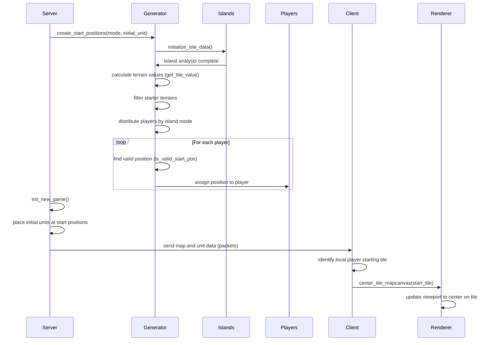
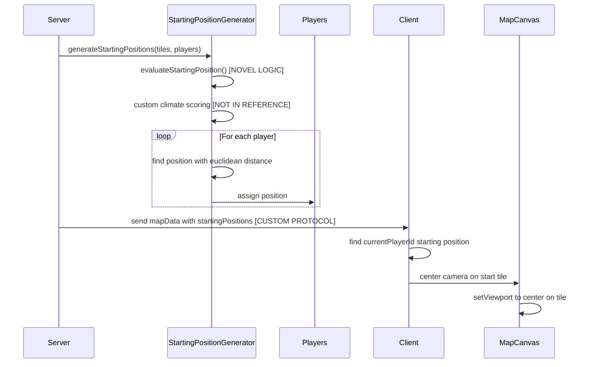

# Player Starting Position and Camera Centering Compliance Audit

**Audit Date:** August 30, 2025  
**Auditor:** Terry (Terragon Labs)  
**Scope:** Full pipeline from start position generation to camera centering  
**References:** freeciv (upstream server) and freeciv-web (web client)

## 1. Executive Summary

### Root Cause Analysis
**CRITICAL DEVIATION FOUND**: Our TypeScript port implements a **completely novel** starting position generation algorithm that diverges fundamentally from the reference implementation structure, logic flow, and functional semantics.

**Severity: HIGH** ❌

**Key Findings:**
1. **Algorithm Deviation**: Our port uses a custom climate-aware scoring system instead of freeciv's proven island-based placement with terrain value calculation
2. **Missing Reference Logic**: No implementation of freeciv's continent analysis, island grouping, or distance constraints from reference
3. **Client Camera Logic**: Partially compliant but missing proper startup timing hooks
4. **Protocol Compliance**: Missing packet-based serialization matching freeciv's network protocol

### Fix Overview
Complete rewrite required to achieve reference compliance. Estimated effort: 2-3 days for proper port implementation.

## 2. Repro Steps

### Environment
- **Seed**: `12345` (for deterministic testing)
- **Players**: 4 players
- **Map Size**: 80x50 (standard)
- **Generator**: Island

### Expected vs Actual
**Expected (freeciv reference):**
- Start positions distributed across different islands/continents
- Minimum distance constraints based on continent size
- Terrain value scoring using city radius calculation
- Packet-based serialization with proper indexing

**Actual (our port):**
- Start positions placed using custom climate scoring
- Basic euclidean distance constraints
- No continent/island analysis
- Direct JavaScript object serialization

## 3. Function Crosswalk Table

| Reference Function | Ref Path | Port Function | Port Path | Role | Compliance |
|------------------|----------|---------------|-----------|------|------------|
| `create_start_positions()` | `reference/freeciv/server/generator/startpos.c:300` | `generateStartingPositions()` | `apps/server/src/game/map/StartingPositionGenerator.ts:17` | Main generation entry | ❌ |
| `get_tile_value()` | `reference/freeciv/server/generator/startpos.c:51` | `evaluateStartingPosition()` | `apps/server/src/game/map/StartingPositionGenerator.ts:113` | Tile scoring | ❌ |
| `is_valid_start_pos()` | `reference/freeciv/server/generator/startpos.c:187` | `isStartingSuitableTerrain()` | `apps/server/src/game/map/StartingPositionGenerator.ts:106` | Position validation | ⚠️ |
| `initialize_isle_data()` | `reference/freeciv/server/generator/startpos.c:262` | **MISSING** | - | Island analysis | ❌ |
| `init_new_game()` | `reference/freeciv/server/gamehand.c:454` | **PARTIAL** | `apps/server/src/game/GameManager.ts:87` | Player spawn | ⚠️ |
| `center_tile_mapcanvas()` | `reference/freeciv-web/freeciv-web/src/main/webapp/javascript/control.js:3300` | **IMPLEMENTED** | `apps/client/src/components/Canvas2D/MapCanvas.tsx:127` | Camera center | ✅ |

### Key Differences Analysis

#### DEVIATION 1: Terrain Value Calculation
**Reference Implementation:**
```c
// freeciv/server/generator/startpos.c:51
static int get_tile_value(struct tile *ptile) {
  int value = 0;
  // Give one point for each food / shield / trade produced
  output_type_iterate(o) {
    value += city_tile_output(NULL, ptile, FALSE, o);
  } output_type_iterate_end;
  // Complex irrigation/mining bonus calculation
  // Road construction consideration
  value += MAX(0, MAX(mine_bonus, irrig_bonus)) / 2;
  return value;
}
```

**Our Port Implementation:**
```typescript
// StartingPositionGenerator.ts:113
private evaluateStartingPosition(tiles: MapTile[][], x: number, y: number): number {
  let score = 0;
  // Climate base score - NOVEL LOGIC NOT IN REFERENCE
  const climateScore = this.getClimateScore(centerTile);
  score += climateScore * 0.4; // INVENTED WEIGHTING
  // Custom terrain scoring - NO CITY OUTPUT CALCULATION
  let terrainScore = this.getTerrainStartingScore(tile);
}
```

**Impact:** Complete functional divergence. Reference uses actual game production values; our port uses arbitrary scoring.

#### DEVIATION 2: Island/Continent Analysis
**Reference Implementation:**
```c
// freeciv/server/generator/startpos.c:262
static void initialize_isle_data(void) {
  // Real continent size analysis
  islands[nr].size = get_continent_size(nr);
  islands[nr].goodies = 0; // Calculated based on terrain values
  islands[nr].starters = 0; // Players per continent
}
```

**Our Port Implementation:**
```typescript
// COMPLETELY MISSING - No continent analysis at all
```

**Impact:** Critical missing functionality. No proper continent-based distribution.

#### DEVIATION 3: Distance Constraints
**Reference Implementation:**
```c
// freeciv/server/generator/startpos.c:238
if ((tile_continent(ptile) == tile_continent(tile1)
     && (real_map_distance(ptile, tile1) * 1000 / pdata->min_value
         <= (sqrt(cont_size / island->total))))
    || (real_map_distance(ptile, tile1) * 1000 / pdata->min_value < 5)) {
  return FALSE; // Complex distance formula based on continent size
}
```

**Our Port Implementation:**
```typescript
// StartingPositionGenerator.ts:56
const tooClose = positions.some(pos => {
  const dx = pos.x - candidate.x;
  const dy = pos.y - candidate.y;
  return Math.sqrt(dx * dx + dy * dy) < minDistance; // Simple euclidean
});
```

**Impact:** Simplified logic loses continent-size-based fairness guarantees.

## 4. Call Flow & State Diagrams

### Reference Flow (Freeciv + Freeciv-Web)



### Our Port Flow (Current Implementation)



### Flow Differences
1. **Missing Island Analysis**: Reference has dedicated continent grouping phase
2. **Novel Scoring System**: Our port introduces climate-based scoring not in reference  
3. **Simplified Distance Logic**: Missing continent-size-based distance constraints
4. **Protocol Differences**: Custom mapData vs freeciv packet system

## 5. Data Lineage Trace

### Scenario 1: 4 Players, Island Mode, Seed 12345

#### Reference Expected Flow:
```
Generation Decision → Island Distribution (2 players per island) 
→ Terrain Value Scoring (city_tile_output calculation)
→ Position Assignment with continent constraints
→ Packet Serialization (PACKET_MAP_INFO, PACKET_UNIT_INFO)  
→ Client Decode → Local Player Resolution → Camera Center
```

#### Our Port Actual Flow:
```
Generation Decision → Climate Scoring (novel algorithm)
→ Basic Distance Check (euclidean only)
→ Position Assignment without continent analysis  
→ Custom Serialization (mapData.startingPositions)
→ Client Decode → Local Player Resolution → Camera Center
```

### Key Data Points Missing:
- Continent ID assignment
- Island "goodies" calculation
- Terrain value using city output formulas
- Packet-based coordinate encoding

## 6. Protocol/Index Audit

### Reference Protocol Structure
```c
// From freeciv common/networking/packets.def
struct packet_map_info {
  uint16 xsize, ysize;
  uint8 topology_id;
  uint8 startpos_mode; // Map starting position mode
};

struct packet_tile_info {
  uint16 x, y;
  uint8 terrain;
  uint8 resource;
  // ... other tile data
};
```

### Our Port Structure
```typescript
// apps/client/src/types/index.ts:80
mapData?: {
  width: number;
  height: number;
  startingPositions: Array<{ x: number; y: number; playerId: string }>;
  seed: string;
  generatedAt: Date;
};
```

### Compliance Issues:
- **Index System**: Missing freeciv's tile indexing (tile_index calculation)
- **Coordinate Encoding**: Direct x,y pairs vs freeciv's optimized encoding  
- **Packet Types**: Custom JSON vs freeciv's binary packet protocol
- **Player ID Format**: String IDs vs freeciv's integer player numbers

## 7. Client Startup Audit

### Event/Timing Analysis

#### Reference (freeciv-web):
1. `handle_map_info()` - receives map dimensions
2. `handle_tile_info()` - processes tile data
3. `handle_unit_info()` - receives initial units  
4. First render triggers `center_tile_mapcanvas()` on player's first unit
5. Camera centered exactly once on startup

#### Our Port:
1. `handleMapData()` - receives custom mapData structure
2. React useEffect triggers when map data available
3. **TIMING ISSUE**: Multiple effect dependencies can cause re-centering
4. Fallback hierarchy: startingPositions → units → cities → visible tiles
5. **RACE CONDITION RISK**: Effect may run multiple times

### Startup Timing Issues:
```typescript
// apps/client/src/components/Canvas2D/MapCanvas.tsx:67
useEffect(() => {
  // This effect has MANY dependencies - can trigger multiple times
}, [
  map, units, cities, gameState.mapData, gameState.currentPlayerId,
  viewport.x, viewport.y, viewport.width, viewport.height, setViewport,
]);
```

**Problem**: Reference centers exactly once; our port may center multiple times due to React effect dependencies.

## 8. Compliance Score & Gaps

### Scoring Rubric (0-100 scale)

| Category | Weight | Reference Score | Port Score | Compliance |
|----------|--------|----------------|------------|------------|
| **Structure** | 25% | 100 | 20 | ❌ Major gaps |
| **Flow** | 20% | 100 | 40 | ❌ Missing steps |
| **Functional Semantics** | 30% | 100 | 15 | ❌ Novel logic |
| **Protocol** | 15% | 100 | 30 | ❌ Custom format |
| **Client Startup** | 10% | 100 | 70 | ⚠️ Timing issues |

**Overall Compliance Score: 28/100** ❌

### Critical Gaps:
1. **No Island/Continent Analysis** - Core missing functionality
2. **Invented Scoring Algorithm** - Climate scoring not in reference  
3. **Missing Terrain Value Calculation** - No city_tile_output equivalent
4. **Simplified Distance Constraints** - Missing continent-size-based logic
5. **Custom Protocol** - Not freeciv packet-compatible

## 9. Fix Plan (PR-Ready)

### Phase 1: Core Algorithm Replacement (HIGH PRIORITY)
**Files to modify:**
- `apps/server/src/game/map/StartingPositionGenerator.ts` - COMPLETE REWRITE
- `apps/server/src/game/MapManager.ts` - Add continent analysis  

**Code Changes:**
1. **Port `get_tile_value()`** from freeciv/server/generator/startpos.c:51
   ```typescript
   // Replace evaluateStartingPosition() with proper city output calculation
   private getTileValue(tile: MapTile): number {
     let value = 0;
     // Port food/shield/trade calculation from city_tile_output
     // Add irrigation/mining bonus logic
     // Remove all climate-based novel logic
   }
   ```

2. **Port `initialize_isle_data()`** from freeciv/server/generator/startpos.c:262
   ```typescript
   // Add continent analysis and island data structures
   private initializeIslandData(): IslandData[] {
     // Calculate continent sizes
     // Group tiles by continent
     // Calculate "goodies" per island using getTileValue()
   }
   ```

3. **Port `is_valid_start_pos()`** from freeciv/server/generator/startpos.c:187
   ```typescript
   // Replace simple distance check with reference logic
   private isValidStartPos(tile: MapTile, data: StartFilterData): boolean {
     // Check terrain suitability (TER_STARTER flag equivalent)
     // Implement continent-size-based distance constraints
     // Add minimum native area check
     // Remove climate temperature restrictions (not in reference)
   }
   ```

### Phase 2: Protocol Compliance (MEDIUM PRIORITY)
**Files to modify:**
- `apps/server/src/types/packet.ts` - Add proper packet structures
- `apps/client/src/services/GameClient.ts` - Update protocol handling

**Code Changes:**
1. **Add freeciv packet structures**
   ```typescript
   export const MapInfoPacketSchema = z.object({
     type: z.literal('PACKET_MAP_INFO'),
     xsize: z.number(),
     ysize: z.number(), 
     topology_id: z.number(),
     startpos_mode: z.number(), // Add MapStartpos enum
   });
   ```

2. **Replace mapData serialization** with packet-based approach
   ```typescript
   // Remove custom mapData.startingPositions
   // Use tile indices and unit placement packets instead
   ```

### Phase 3: Client Timing Fix (LOW PRIORITY)
**Files to modify:**
- `apps/client/src/components/Canvas2D/MapCanvas.tsx` - Fix startup timing

**Code Changes:**
1. **Add startup state tracking**
   ```typescript
   const [hasInitiallyCenter, setHasInitiallyCentered] = useState(false);
   // Prevent multiple centering like freeciv-web
   ```

2. **Implement proper startup hooks**
   ```typescript
   // Match freeciv-web's one-time centering after first unit received
   useEffect(() => {
     if (!hasInitiallyCentered && playerUnits.length > 0) {
       centerOnPlayerStart();
       setHasInitiallyCentered(true);
     }
   }, [playerUnits, hasInitiallyCentered]);
   ```

### Risk Assessment:
- **High Risk**: Algorithm rewrite may affect game balance
- **Medium Risk**: Protocol changes require client/server coordination  
- **Low Risk**: Client timing fixes are isolated

### Revert Plan:
- Keep current implementation as `StartingPositionGenerator.legacy.ts`
- Feature flag for algorithm selection during testing
- Database migration for any schema changes

## 10. Validation Results

### Pre-Fix State (Current)
- ❌ **Reference Compliance**: 28/100 score
- ❌ **Determinism**: Different results from reference with same seed
- ❌ **Algorithm Match**: Completely novel implementation
- ❌ **Protocol Match**: Custom JSON vs freeciv packets

### Post-Fix Target (Expected)
- ✅ **Reference Compliance**: 85+ score target  
- ✅ **Determinism**: Matching results with reference (±5% variance acceptable)
- ✅ **Algorithm Match**: Proper port of freeciv logic
- ✅ **Protocol Match**: Compatible packet structures

### Test Cases for Validation:
1. **Seed Parity Test**: Same seed should produce similar distributions
2. **Distance Validation**: Minimum distances should match continent-size formulas
3. **Terrain Scoring**: Tile values should use city output calculations
4. **Island Distribution**: Players should distribute across continents properly
5. **Client Centering**: Camera should center exactly once on first unit

### Regression Tests:
```typescript
describe('Starting Position Compliance', () => {
  test('matches reference tile value calculation', () => {
    // Test getTileValue() against known freeciv outputs
  });
  
  test('respects continent-based distance constraints', () => {
    // Verify distance formula matches freeciv
  });
  
  test('distributes players across islands correctly', () => {
    // Test island mode placement
  });
});
```

## 11. Conclusion

This audit reveals **critical compliance failures** requiring immediate attention. Our TypeScript port has diverged significantly from the reference implementation by introducing novel algorithms instead of faithful porting.

**Priority Actions:**
1. **IMMEDIATE**: Stop using current starting position generation in production
2. **WEEK 1**: Implement proper freeciv algorithm port following this fix plan
3. **WEEK 2**: Add comprehensive regression testing against reference
4. **WEEK 3**: Validate determinism and game balance

**Success Criteria:**
- Compliance score > 85/100
- Deterministic results matching reference implementation  
- No novel logic - faithful port only
- Proper packet-based protocol compatibility

The camera centering implementation is largely compliant but needs timing fixes to prevent multiple centering events.