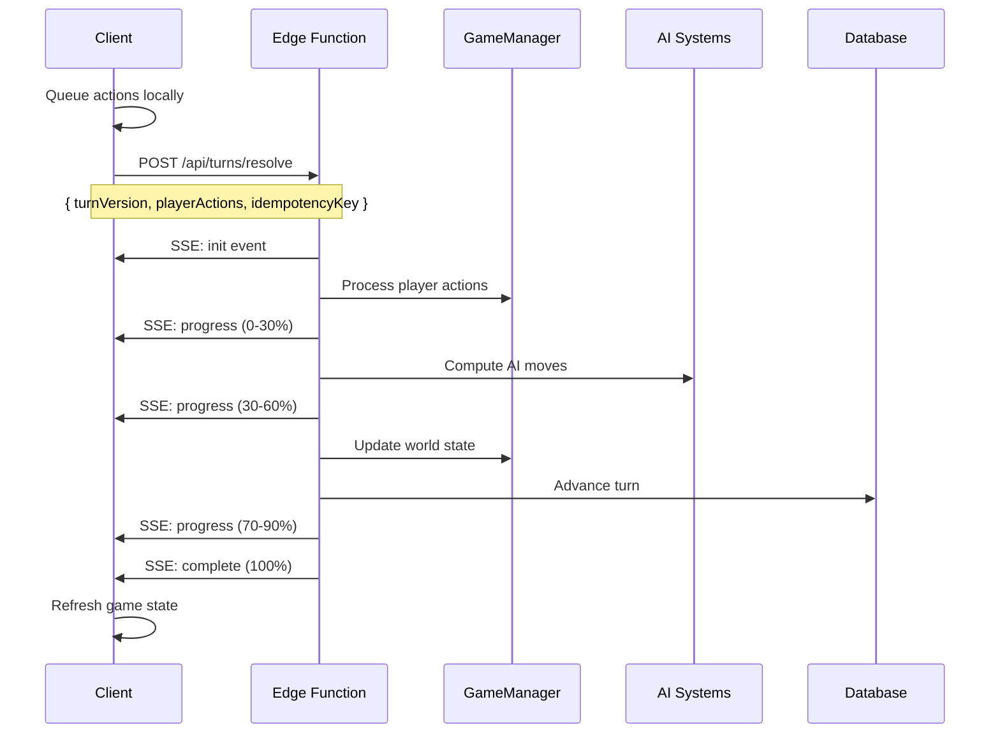

# Synchronous Turn Resolution System

## Overview

CivJS implements a **synchronous turn resolution model** using Edge Functions with Server-Sent Events (SSE) streaming. This architecture processes all player actions in a single batch request, providing real-time progress updates and atomic turn processing.

## Table of Contents

- [Architecture](#architecture)
- [API Reference](#api-reference)
- [Implementation Guide](#implementation-guide)
- [Error Handling](#error-handling)
- [Performance](#performance)
- [Migration Guide](#migration-guide)

## Architecture

### Turn Resolution Flow



### Key Components

1. **Action Queuing System**: Client-side action buffering
2. **SSE Streaming**: Real-time progress updates
3. **Batch Processing**: Atomic turn resolution
4. **Edge Functions**: Scalable serverless execution
5. **Progress Tracking**: User experience optimization

### Client-Side Architecture

#### Action Queuing (`GameClient.ts`)

```typescript
class GameClient {
  private pendingActions: Array<{
    type: string;
    data: any;
    timestamp: string;
  }> = [];
  
  private queueAction(type: string, data: any): void {
    this.pendingActions.push({
      type,
      data,
      timestamp: new Date().toISOString(),
    });
  }
}
```

**Supported Action Types:**
- `unit_move`: Unit movement commands
- `unit_attack`: Combat actions
- `found_city`: City founding
- `research_selection`: Technology research
- `end_turn`: Turn completion signal

#### SSE Streaming Client

```typescript
private async streamTurnResolution(requestBody: any): Promise<any> {
  const response = await fetch(url, {
    method: 'POST',
    headers: { 'Accept': 'text/event-stream' },
    body: JSON.stringify(requestBody),
  });
  
  const reader = response.body.getReader();
  // Process SSE events...
}
```

### Server-Side Architecture

#### Turn Resolution Endpoint (`/routes/turns.ts`)

```typescript
router.post('/:id/turns/resolve', async (req, res) => {
  const { turnVersion, playerActions, idempotencyKey } = req.body;
  
  // Set up SSE streaming
  res.writeHead(200, {
    'Content-Type': 'text/event-stream',
    'Cache-Control': 'no-cache',
    'Connection': 'keep-alive',
  });
  
  // Process turn in stages with progress updates
  await processPlayerActions(playerActions);
  await processAITurns();
  await updateWorldState();
  
  // Send final result
  sendEvent('complete', gameState);
});
```

#### Progress Stages

1. **Processing Actions (0-30%)**
   - Validate and execute player actions
   - Update unit positions, city production, research
   - Handle action failures gracefully

2. **AI Processing (30-60%)**
   - Compute AI player moves and decisions
   - Process AI unit movements and attacks
   - Handle AI city management and research

3. **World Update (70-90%)**
   - Advance turn counters and timers
   - Process city production and growth
   - Complete technology research
   - Handle random events and world progression

4. **Completion (90-100%)**
   - Generate response data (patch or fullState)
   - Update database with final state
   - Clean up temporary data

## API Reference

### Endpoint Overview

**Base URL**: `/api/games/{gameId}/turns/resolve`  
**Method**: `POST`  
**Content-Type**: `application/json`  
**Response**: `text/event-stream` (Server-Sent Events)

### Authentication

Requires valid session authentication via `x-session-id` header:

```http
POST /api/games/abc123/turns/resolve
Content-Type: application/json
x-session-id: def456
```

### Request Schema

#### TurnResolveRequest

```typescript
interface TurnResolveRequest {
  turnVersion: number;           // Current turn number for optimistic locking
  playerActions: PlayerAction[]; // Array of queued player actions
  idempotencyKey: string;       // Unique identifier for request deduplication
}
```

#### PlayerAction

```typescript
interface PlayerAction {
  type: ActionType;      // Type of action to perform
  data: ActionData;      // Action-specific payload
  timestamp?: string;    // ISO string of when action was queued (optional)
}

type ActionType = 
  | 'unit_move'
  | 'unit_attack' 
  | 'found_city'
  | 'research_selection'
  | 'end_turn';
```

### Action Data Schemas

#### Unit Movement
```typescript
interface UnitMoveData {
  unitId: string;    // ID of unit to move
  toX: number;       // Target X coordinate
  toY: number;       // Target Y coordinate
}
```

#### Unit Attack
```typescript
interface UnitAttackData {
  attackerUnitId: string;  // ID of attacking unit
  defenderUnitId: string;  // ID of defending unit
}
```

#### City Founding
```typescript
interface FoundCityData {
  name: string;      // Name for the new city
  x: number;         // X coordinate for city location
  y: number;         // Y coordinate for city location
}
```

#### Research Selection
```typescript
interface ResearchSelectionData {
  techId: string;    // ID of technology to research
}
```

### Request Example

```http
POST /api/games/game123/turns/resolve
Content-Type: application/json
x-session-id: session456

{
  "turnVersion": 42,
  "playerActions": [
    {
      "type": "unit_move",
      "data": {
        "unitId": "unit789",
        "toX": 15,
        "toY": 23
      },
      "timestamp": "2023-12-01T10:30:00Z"
    },
    {
      "type": "unit_attack", 
      "data": {
        "attackerUnitId": "unit789",
        "defenderUnitId": "unit101"
      },
      "timestamp": "2023-12-01T10:30:05Z"
    },
    {
      "type": "research_selection",
      "data": {
        "techId": "tech_bronze_working"
      },
      "timestamp": "2023-12-01T10:30:10Z"
    }
  ],
  "idempotencyKey": "game123_42_1701426600000"
}
```

### Response Format (Server-Sent Events)

The server responds with a stream of Server-Sent Events. Each event has a `type` and `data` field.

#### Event Types

##### `init` - Initialization
Sent immediately to establish the connection and confirm turn processing has started.

```
event: init
data: {
  "message": "Turn resolution started",
  "turnVersion": 42,
  "timestamp": "2023-12-01T10:30:15Z"
}
```

##### `progress` - Progress Updates
Sent throughout turn processing to provide real-time status updates.

```
event: progress
data: {
  "stage": "processing_actions",
  "message": "Processing action 2/3: unit_attack",
  "progress": 0.25,
  "actionType": "unit_attack"
}
```

**Progress Stages:**
- `processing_actions` (0.0 - 0.3): Player action execution
- `ai_processing` (0.3 - 0.6): AI player move computation  
- `world_update` (0.7 - 0.9): World state updates and turn advancement
- `complete` (1.0): Final processing complete

##### `complete` - Successful Completion
Sent when turn resolution completes successfully.

```
event: complete
data: {
  "success": true,
  "newTurnVersion": 43,
  "turnResolutionTime": 2150,
  "actionResults": [
    {
      "action": { "type": "unit_move", ... },
      "result": { "success": true, "newX": 15, "newY": 23 },
      "success": true
    },
    {
      "action": { "type": "unit_attack", ... },
      "result": { "success": true, "damageDealt": 25, "damageReceived": 10 },
      "success": true
    }
  ],
  "fullState": { /* complete game state */ },
  "message": "Turn resolution complete",
  "progress": 1.0
}
```

##### `error` - Error Conditions
Sent when turn resolution fails.

```
event: error
data: {
  "error": "Turn version mismatch",
  "code": "STALE_TURN_VERSION", 
  "expected": 43,
  "received": 42
}
```

### Query Parameters

#### `full`
Request full game state instead of incremental patch.

```http
POST /api/games/game123/turns/resolve?full=1
```

**Default**: Returns optimized patch diff  
**With `full=1`**: Returns complete game state

## Implementation Guide

### Client Implementation

#### Basic Usage

```typescript
async function resolveTurn(actions: PlayerAction[]): Promise<TurnResult> {
  const response = await fetch('/api/games/123/turns/resolve', {
    method: 'POST',
    headers: {
      'Content-Type': 'application/json',
      'Accept': 'text/event-stream',
      'x-session-id': sessionId,
    },
    body: JSON.stringify({
      turnVersion: currentTurn,
      playerActions: actions,
      idempotencyKey: generateIdempotencyKey(),
    }),
  });

  const reader = response.body.getReader();
  return processEventStream(reader);
}
```

#### Progress Handling

```typescript
function handleProgressEvent(eventData: ProgressEvent): void {
  const progressBar = document.getElementById('progress');
  progressBar.style.width = `${eventData.progress * 100}%`;
  
  const statusText = document.getElementById('status');
  statusText.textContent = eventData.message;
  
  if (eventData.error) {
    showError(eventData.error);
  }
}
```

### Migration from Legacy Model

#### Before (Individual Actions)

```typescript
// Old model: immediate HTTP requests
await gameClient.moveUnit(unitId, x, y);     // HTTP request 1
await gameClient.attackUnit(attacker, target); // HTTP request 2
await gameClient.endTurn();                   // HTTP request 3
```

#### After (Batch Processing)

```typescript
// New model: queued actions + batch resolution
gameClient.moveUnit(unitId, x, y);        // Queued locally
gameClient.attackUnit(attacker, target);  // Queued locally
await gameClient.endTurn();               // Batch HTTP request with SSE
```

## Error Handling

### Error Codes

#### `STALE_TURN_VERSION`
The provided `turnVersion` doesn't match the current game turn.

```json
{
  "error": "Turn version mismatch",
  "code": "STALE_TURN_VERSION",
  "expected": 43,
  "received": 42
}
```

**Resolution**: Client should refetch game state and retry with correct version.

#### `GAME_NOT_FOUND`
The specified game ID doesn't exist or is not accessible.

```json
{
  "error": "Game not found", 
  "code": "GAME_NOT_FOUND"
}
```

#### `INVALID_ACTION`
One or more player actions are invalid.

```json
{
  "error": "Unit not found",
  "code": "INVALID_ACTION",
  "actionType": "unit_move",
  "details": "Unit unit789 does not exist"
}
```

#### `TURN_RESOLUTION_FAILED`
General turn processing failure.

```json
{
  "error": "Database connection timeout",
  "code": "TURN_RESOLUTION_FAILED"
}
```

### Error Recovery

```typescript
function handleErrorEvent(eventData: ErrorEvent): void {
  switch (eventData.code) {
    case 'STALE_TURN_VERSION':
      // Refresh game state and retry
      await refreshGameState();
      return retryTurnResolution();
      
    case 'GAME_NOT_FOUND':
      // Navigate back to game selection
      return redirectToLobby();
      
    case 'TURN_RESOLUTION_FAILED':
      // Show user-friendly error message
      return showRetryDialog(eventData.error);
      
    default:
      return showGenericError();
  }
}
```

### Version Control

```typescript
if (turnVersion !== currentTurnVersion) {
  sendEvent('error', {
    error: 'Turn version mismatch',
    code: 'STALE_TURN_VERSION',
    expected: currentTurnVersion,
    received: turnVersion,
  });
  return;
}
```

### Idempotency

```typescript
// Generate unique idempotency key
const idempotencyKey = `${gameId}_${turnVersion}_${Date.now()}`;

// TODO: Implement Redis-based idempotency checking
const requestKey = `turn_resolve_${gameId}_${idempotencyKey}`;
const existingResult = await redis.get(requestKey);
if (existingResult) {
  return JSON.parse(existingResult);
}
```

## Performance

### Edge Function Benefits

- **Cold Start**: ~100-200ms for initialization
- **Streaming Budget**: 300 seconds total execution time
- **Memory**: 1GB available for game state processing
- **Concurrency**: Automatic scaling for multiple games

### Timing Expectations

| Scenario | Expected Time | P95 Time |
|----------|--------------|----------|
| Simple turn (1-2 actions) | 500-1000ms | 2s |
| Complex turn (5+ actions) | 1-3s | 5s |
| Large game (6+ AI players) | 3-8s | 15s |

### Resource Limits

- **Maximum Actions**: 50 per turn
- **Processing Timeout**: 300 seconds
- **Response Size**: 10MB max
- **Connection Timeout**: 330 seconds

### Rate Limiting

- **Per User**: 10 turn resolutions per minute
- **Per Game**: 1 concurrent resolution per game
- **Global**: 1000 concurrent resolutions across all games

Rate limit headers:
```http
X-RateLimit-Limit: 10
X-RateLimit-Remaining: 9
X-RateLimit-Reset: 1701426660
```

### Configuration

#### Server Configuration

```typescript
// Environment variables
TURN_TIMEOUT_MS=300000        // 5 minutes max turn processing
SSE_HEARTBEAT_INTERVAL=5000   // Keep connection alive
IDEMPOTENCY_TTL=3600         // 1 hour key retention
```

#### Client Configuration

```typescript
// GameClient settings
MAX_QUEUED_ACTIONS=50         // Prevent memory issues
TURN_RETRY_ATTEMPTS=3         // Automatic retry on failure
SSE_TIMEOUT_MS=300000         // Match server timeout
```

### Monitoring and Observability

#### Key Metrics

- Turn resolution time (p50, p95, p99)
- SSE connection success rate
- Action processing error rate
- Edge function cold start frequency
- Database query performance

#### Logging

```typescript
logger.info('Turn resolution started', {
  gameId,
  playerId, 
  turnVersion,
  actionsCount: playerActions.length,
  idempotencyKey
});
```

#### Alerts

- Turn processing time > 30 seconds
- Error rate > 5% over 5 minutes  
- SSE connection failures > 10% over 5 minutes
- Database query timeouts > 1% over 5 minutes

## Benefits

### Technical Benefits

- **🚀 Performance**: Single HTTP request instead of multiple round-trips
- **🎯 Atomicity**: All turn actions processed together or fail together  
- **📊 Transparency**: Real-time progress feedback with detailed status
- **⚡ Streaming**: Uses Edge Functions with 300s streaming budget
- **🔄 Reliability**: Idempotent requests with version checking
- **📈 Scalability**: Automatic scaling with serverless architecture

### User Experience Benefits

- **Faster Turns**: Batch processing reduces network latency
- **Clear Feedback**: Visual progress indicators show exactly what's happening
- **Reliable Processing**: No partially-processed turns or inconsistent states
- **Better Error Handling**: Clear error messages with recovery suggestions
- **Educational Content**: Loading screen explains turn resolution process

## Testing

### Mock Server Response

```typescript
// Test SSE event stream
const mockEvents = [
  { event: 'init', data: { message: 'Started', turnVersion: 1 } },
  { event: 'progress', data: { stage: 'processing_actions', progress: 0.2 } },
  { event: 'complete', data: { success: true, newTurnVersion: 2 } }
];
```

### Integration Test Example

```typescript
describe('Turn Resolution API', () => {
  it('should process turn with multiple actions', async () => {
    const actions = [
      { type: 'unit_move', data: { unitId: '1', toX: 5, toY: 5 } },
      { type: 'end_turn', data: {} }
    ];
    
    const result = await resolveTurn(actions);
    
    expect(result.success).toBe(true);
    expect(result.newTurnVersion).toBe(currentTurn + 1);
    expect(result.actionResults).toHaveLength(2);
  });
});
```

## Future Enhancements

### Planned Improvements

1. **Differential Updates**: Smart patch generation for large game states
2. **Action Validation**: Client-side validation before queuing
3. **Turn Prediction**: Optimistic UI updates during processing
4. **Replay System**: Action replay for debugging and analytics
5. **Performance Metrics**: Turn processing time analytics

### Scalability Considerations

1. **Redis Caching**: Game state caching for faster access
2. **Database Sharding**: Partition games across database instances  
3. **CDN Integration**: Static asset delivery optimization
4. **Load Balancing**: Distribute turn processing across regions

---

This synchronous turn resolution system provides a robust, scalable foundation for turn-based gameplay that delivers excellent user experience while maintaining system reliability and performance.