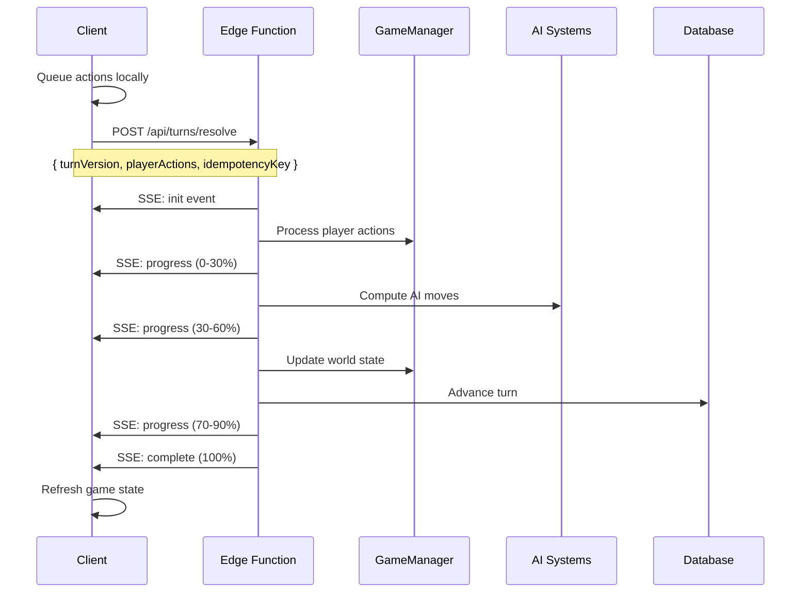

# Turn Resolution Architecture

## Overview

CivJS implements a **synchronous turn resolution model** using Edge Functions with Server-Sent Events (SSE) streaming. This architecture processes all player actions in a single batch request, providing real-time progress updates and atomic turn processing.

## Architecture Model

### Turn Resolution Flow



### Key Components

1. **Action Queuing System**: Client-side action buffering
2. **SSE Streaming**: Real-time progress updates
3. **Batch Processing**: Atomic turn resolution
4. **Edge Functions**: Scalable serverless execution
5. **Progress Tracking**: User experience optimization

## Implementation Details

### Client-Side Architecture

#### Action Queuing (`GameClient.ts`)

```typescript
class GameClient {
  private pendingActions: Array<{
    type: string;
    data: any;
    timestamp: string;
  }> = [];
  
  private queueAction(type: string, data: any): void {
    this.pendingActions.push({
      type,
      data,
      timestamp: new Date().toISOString(),
    });
  }
}
```

**Supported Action Types:**
- `unit_move`: Unit movement commands
- `unit_attack`: Combat actions
- `found_city`: City founding
- `research_selection`: Technology research
- `end_turn`: Turn completion signal

#### SSE Streaming Client

```typescript
private async streamTurnResolution(requestBody: any): Promise<any> {
  const response = await fetch(url, {
    method: 'POST',
    headers: { 'Accept': 'text/event-stream' },
    body: JSON.stringify(requestBody),
  });
  
  const reader = response.body.getReader();
  // Process SSE events...
}
```

### Server-Side Architecture

#### Turn Resolution Endpoint (`/routes/turns.ts`)

```typescript
router.post('/:id/turns/resolve', async (req, res) => {
  const { turnVersion, playerActions, idempotencyKey } = req.body;
  
  // Set up SSE streaming
  res.writeHead(200, {
    'Content-Type': 'text/event-stream',
    'Cache-Control': 'no-cache',
    'Connection': 'keep-alive',
  });
  
  // Process turn in stages with progress updates
  await processPlayerActions(playerActions);
  await processAITurns();
  await updateWorldState();
  
  // Send final result
  sendEvent('complete', gameState);
});
```

#### Progress Stages

1. **Processing Actions (0-30%)**
   - Validate and execute player actions
   - Update unit positions, city production, research
   - Handle action failures gracefully

2. **AI Processing (30-60%)**
   - Compute AI player moves and decisions
   - Process AI unit movements and attacks
   - Handle AI city management and research

3. **World Update (70-90%)**
   - Advance turn counters and timers
   - Process city production and growth
   - Complete technology research
   - Handle random events and world progression

4. **Completion (90-100%)**
   - Generate response data (patch or fullState)
   - Update database with final state
   - Clean up temporary data

## API Specification

### Request Format

```typescript
POST /api/games/{gameId}/turns/resolve

interface TurnResolveRequest {
  turnVersion: number;           // Current turn number for version checking
  playerActions: PlayerAction[]; // Queued actions to process
  idempotencyKey: string;       // Unique key for request deduplication
}

interface PlayerAction {
  type: 'unit_move' | 'unit_attack' | 'found_city' | 'research_selection' | 'end_turn';
  data: any;                    // Action-specific data
  timestamp?: string;           // When action was queued
}
```

### Response Format (SSE Events)

```typescript
// Initialization event
event: init
data: {
  "message": "Turn resolution started",
  "turnVersion": 42,
  "timestamp": "2023-12-01T10:00:00Z"
}

// Progress events
event: progress
data: {
  "stage": "processing_actions",
  "message": "Processing 3 player actions",
  "progress": 0.15,
  "actionType": "unit_move"
}

// Completion event
event: complete
data: {
  "success": true,
  "newTurnVersion": 43,
  "turnResolutionTime": 1250,
  "actionResults": [...],
  "fullState": {...} // or "patch": {...}
}

// Error event
event: error
data: {
  "error": "Turn version mismatch",
  "code": "STALE_TURN_VERSION",
  "expected": 42,
  "received": 41
}
```

### Query Parameters

- `?full=1`: Request full game state instead of patch diff

## Error Handling

### Version Conflicts

```typescript
if (turnVersion !== currentTurnVersion) {
  sendEvent('error', {
    error: 'Turn version mismatch',
    code: 'STALE_TURN_VERSION',
    expected: currentTurnVersion,
    received: turnVersion,
  });
  return;
}
```

### Idempotency

```typescript
// TODO: Implement Redis-based idempotency checking
const requestKey = `turn_resolve_${gameId}_${idempotencyKey}`;
const existingResult = await redis.get(requestKey);
if (existingResult) {
  return JSON.parse(existingResult);
}
```

### Connection Failures

- Client automatically retries with same `idempotencyKey`
- Server prevents duplicate processing
- Graceful fallback to error state with user notification

## Performance Characteristics

### Edge Function Benefits

- **Cold Start**: ~100-200ms for initialization
- **Streaming Budget**: 300 seconds total execution time
- **Memory**: 1GB available for game state processing
- **Concurrency**: Automatic scaling for multiple games

### Timing Expectations

- **Simple Turn** (1-3 actions): ~500-1000ms
- **Complex Turn** (5+ actions + AI): ~2000-5000ms
- **Large Game** (6+ AI players): ~5000-10000ms

### Resource Usage

- **Database Queries**: Batched for efficiency
- **Memory**: Game state cached during processing
- **Network**: SSE streaming reduces client polling
- **CPU**: AI computation dominates processing time

## User Experience

### Loading States

The client displays a rich loading overlay with:

1. **Progress Indicators**
   - Overall progress bar (0-100%)
   - Current stage name and description
   - Action-by-action progress tracking

2. **Educational Content**
   - Tips about turn resolution process
   - Explanation of concurrent AI processing
   - Information about atomic turn processing

3. **Error Handling**
   - Clear error messages for failures
   - Retry options for recoverable errors
   - Graceful degradation for severe issues

### Visual Progress Stages

```typescript
const stageColors = {
  'processing_actions': 'bg-blue-500',    // Player actions
  'ai_processing': 'bg-yellow-500',       // AI computation  
  'world_update': 'bg-orange-500',        // World events
  'complete': 'bg-green-500'              // Finished
};
```

## Migration from Legacy Model

### Before (Individual Actions)

```typescript
// Old model: immediate HTTP requests
await gameClient.moveUnit(unitId, x, y);     // HTTP request 1
await gameClient.attackUnit(attacker, target); // HTTP request 2
await gameClient.endTurn();                   // HTTP request 3
```

### After (Batch Processing)

```typescript
// New model: queued actions + batch resolution
gameClient.moveUnit(unitId, x, y);        // Queued locally
gameClient.attackUnit(attacker, target);  // Queued locally
await gameClient.endTurn();               // Batch HTTP request with SSE
```

### Benefits of Migration

- **Reduced Network Requests**: 1 instead of N requests per turn
- **Atomic Processing**: All actions succeed or fail together
- **Better UX**: Real-time progress instead of sequential loading
- **Improved Performance**: Batch database operations
- **Enhanced Reliability**: Version checking and idempotency

## Configuration

### Server Configuration

```typescript
// Environment variables
TURN_TIMEOUT_MS=300000        // 5 minutes max turn processing
SSE_HEARTBEAT_INTERVAL=5000   // Keep connection alive
IDEMPOTENCY_TTL=3600         // 1 hour key retention
```

### Client Configuration

```typescript
// GameClient settings
MAX_QUEUED_ACTIONS=50         // Prevent memory issues
TURN_RETRY_ATTEMPTS=3         // Automatic retry on failure
SSE_TIMEOUT_MS=300000         // Match server timeout
```

## Future Enhancements

### Planned Improvements

1. **Differential Updates**: Smart patch generation for large game states
2. **Action Validation**: Client-side validation before queuing
3. **Turn Prediction**: Optimistic UI updates during processing
4. **Replay System**: Action replay for debugging and analytics
5. **Performance Metrics**: Turn processing time analytics

### Scalability Considerations

1. **Redis Caching**: Game state caching for faster access
2. **Database Sharding**: Partition games across database instances  
3. **CDN Integration**: Static asset delivery optimization
4. **Load Balancing**: Distribute turn processing across regions

## Monitoring and Observability

### Key Metrics

- Turn resolution time (p50, p95, p99)
- SSE connection success rate
- Action processing error rate
- Edge function cold start frequency
- Database query performance

### Logging

```typescript
logger.info('Turn resolution started', {
  gameId,
  playerId, 
  turnVersion,
  actionsCount: playerActions.length,
  idempotencyKey
});
```

### Alerts

- Turn processing time > 30 seconds
- Error rate > 5% over 5 minutes  
- SSE connection failures > 10% over 5 minutes
- Database query timeouts > 1% over 5 minutes

---

This architecture provides a robust, scalable foundation for turn-based gameplay that delivers excellent user experience while maintaining system reliability and performance.